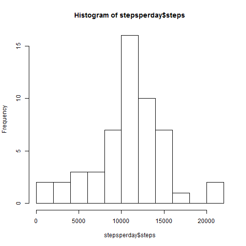
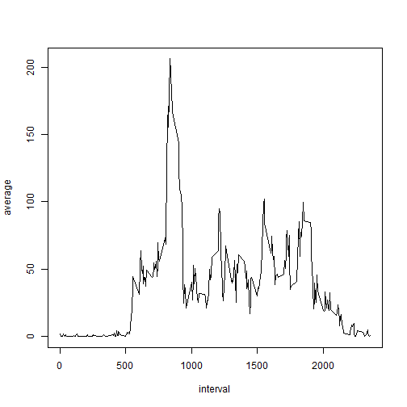
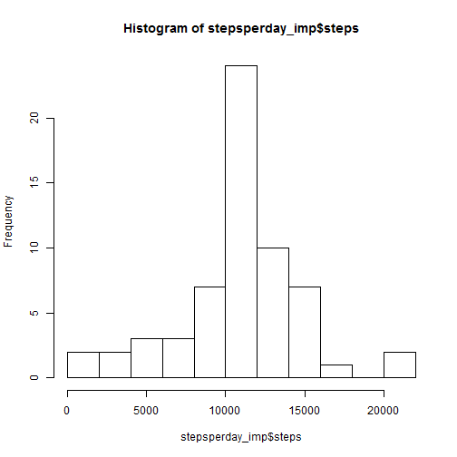
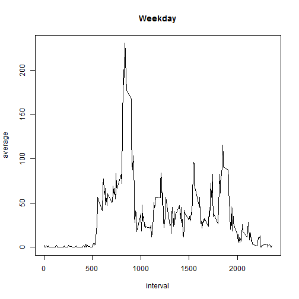
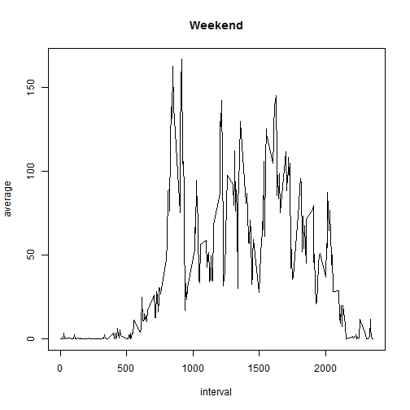

#### LOADING AND PREPROCESSING THE DATA


Load Raw Data


```r
data <- read.csv("activity.csv")
data$date = as.Date(data$date)
dates <- unique(data$date)
```


#### WHAT IS THE MEAN TOTAL NUMBER OF STEPS TAKEN PER DAY?

Calculate the mean total number of steps per day and create a data frame of the sums.


```r
stepsperday <- data.frame()
for (i in 1:61){
        a <- dates[i]
        daydata <- data[which(data[, 2] == a), ]
        date <- as.Date(a)
        steps <- sum(daydata[, 1])
        row <- as.data.frame(cbind(date, steps))
        stepsperday <- rbind(stepsperday, row)
}
```

Make a histogram of the total number of steps per day.


```r
hist(stepsperday$steps, breaks = 15)
```

 

Report the mean and median total number of steps per day.


```r
mean <- mean(stepsperday$steps, na.rm = TRUE)
median <- median(stepsperday$steps, na.rm = TRUE)

mean
```

```
## [1] 10766.19
```

```r
median
```

```
## [1] 10765
```


#### WHAT IS THE AVERAGE DAILY ACTIVITY PATTERN?

Make a time series plot (i.e. type = 1) of the 5 - minute interval(x-axis) and the average number of steps taken, averaged across all days (y- axis).


```r
intervals <- as.numeric(unique(data[, 3]))
stepsperinterval <- data.frame()
for (x in 1:288) {
        interval <- intervals[x]
        data_int <- data[which(data[, 3] == interval), ]
        average <- mean(data_int[, 1], na.rm = TRUE)
        temprow <- as.data.frame(cbind(interval, average))
        stepsperinterval <- rbind(stepsperinterval, temprow)
}

plot(stepsperinterval, type = "l")
```

 

Which interval, on average across all the days in the dataset, contains the maximum number of steps?


```r
max <- max(stepsperinterval[, 2])
maxinterval <- stepsperinterval[which(stepsperinterval[, 2] == max), ]
maxinterval
```

```
##     interval  average
## 104      835 206.1698
```


#### IMPUTING MISSING VALUES

Devise a strategy for filling in all of the missing values in the dataset.  The strategy does not need to be sophisticated.  For example, you could use the mean/median for that day, or the mean for that 5-minute interval, etc.

Create a new dataset that is equal to the original dataset but with the missing data filled in.


```r
data_imputed <- data
summary(data_imputed)
```

```
##      steps             date               interval     
##  Min.   :  0.00   Min.   :2012-10-01   Min.   :   0.0  
##  1st Qu.:  0.00   1st Qu.:2012-10-16   1st Qu.: 588.8  
##  Median :  0.00   Median :2012-10-31   Median :1177.5  
##  Mean   : 37.38   Mean   :2012-10-31   Mean   :1177.5  
##  3rd Qu.: 12.00   3rd Qu.:2012-11-15   3rd Qu.:1766.2  
##  Max.   :806.00   Max.   :2012-11-30   Max.   :2355.0  
##  NA's   :2304
```

```r
for (c in 1:17568) {
        if (is.na(data_imputed[c, 1])) {
                data_sub <- data_imputed[which(data_imputed[, 3] == data_imputed[c, 3]), ]
                avg <- mean(data_sub[, 1], na.rm = TRUE)
                data_imputed[c, 1] <- avg
        }
}

summary(data_imputed)
```

```
##      steps             date               interval     
##  Min.   :  0.00   Min.   :2012-10-01   Min.   :   0.0  
##  1st Qu.:  0.00   1st Qu.:2012-10-16   1st Qu.: 588.8  
##  Median :  0.00   Median :2012-10-31   Median :1177.5  
##  Mean   : 37.38   Mean   :2012-10-31   Mean   :1177.5  
##  3rd Qu.: 27.00   3rd Qu.:2012-11-15   3rd Qu.:1766.2  
##  Max.   :806.00   Max.   :2012-11-30   Max.   :2355.0
```

Make a histogram of the total number of steps taken each day and calculate and report the mean and median total number of steps taken per day.  Do these values differ from the estimates from the first part of the assignment?  What is the impact of imputing the missing data on the estimates of the total daily number of steps?


```r
stepsperday_imp <- data.frame()
for (i in 1:61){
        a <- dates[i]
        daydata <- data_imputed[which(data_imputed[, 2] == a), ]
        date <- as.Date(a)
        steps <- sum(daydata[, 1])
        row <- as.data.frame(cbind(date, steps))
        stepsperday_imp <- rbind(stepsperday_imp, row)
}

hist(stepsperday_imp$steps, breaks = 15)
```

 

```r
mean_imp <- mean(stepsperday_imp$steps, na.rm = TRUE)
median_imp <- median(stepsperday_imp$steps, na.rm = TRUE)

mean_imp
```

```
## [1] 10766.19
```

```r
median_imp
```

```
## [1] 10766.19
```


#### ARE THERE DIFFERENCES IN ACTIVITY PATTERN BETWEEN WEEKDAYS AND WEEKENDS?

Create a new factor variable in the dataset with two levels - "weekday" and "weekend" indicating whether a given date is a weekday or weekend day.


```r
data_imputed$day <- weekdays(data_imputed$date)
for (z in 1:17568) {
        if (data_imputed$day[z] == "Saturday") {
                data_imputed$weekday[z] = "Weekend"
        }
        else if (data_imputed$day[z] == "Sunday") {
                data_imputed$weekday[z] = "Weekend"
        }
        else {
                data_imputed$weekday[z] = "Weekday"
        }
}

summary(data_imputed)
```

```
##      steps             date               interval          day           
##  Min.   :  0.00   Min.   :2012-10-01   Min.   :   0.0   Length:17568      
##  1st Qu.:  0.00   1st Qu.:2012-10-16   1st Qu.: 588.8   Class :character  
##  Median :  0.00   Median :2012-10-31   Median :1177.5   Mode  :character  
##  Mean   : 37.38   Mean   :2012-10-31   Mean   :1177.5                     
##  3rd Qu.: 27.00   3rd Qu.:2012-11-15   3rd Qu.:1766.2                     
##  Max.   :806.00   Max.   :2012-11-30   Max.   :2355.0                     
##    weekday         
##  Length:17568      
##  Class :character  
##  Mode  :character  
##                    
##                    
## 
```

Make a panel plot containing a time series plot (i.e. type = "l") of the 5-minute interval (x-axis) and the average number of steps taken, averaged across all weekday days or weekend days (y-axis). See the README file in the github repository to see an example of what this plot should look like using simulated data.


```r
stepsperinterval_week <- data.frame()
for (x in 1:288) {
        interval <- intervals[x]
        data_week <- data_imputed[which(data_imputed[, 5] == "Weekday"), ]
        data_int <- data_week[which(data_week[, 3] == interval), ]
        average <- mean(data_int[, 1], na.rm = TRUE)
        #day <- "Weekday"
        temprow <- as.data.frame(cbind(interval, average))
        stepsperinterval_week <- rbind(stepsperinterval_week, temprow)
}

avgsteps_week <- plot(stepsperinterval_week, type = "l", main = "Weekday")
```

 

```r
stepsperinterval_wknd <- data.frame()
for (x in 1:288) {
        interval <- intervals[x]
        data_week <- data_imputed[which(data_imputed[, 5] == "Weekend"), ]
        data_int <- data_week[which(data_week[, 3] == interval), ]
        average <- mean(data_int[, 1], na.rm = TRUE)
        #day <- "Weekend"
        temprow <- as.data.frame(cbind(interval, average))
        stepsperinterval_wknd <- rbind(stepsperinterval_wknd, temprow)
}

avgsteps_wknd <- plot(stepsperinterval_wknd, type = "l", main = "Weekend")

stepsperinterval_week$day <- "Weekday"
stepsperinterval_wknd$day <- "Weekend"
avgsteps <- rbind(stepsperinterval_week, stepsperinterval_wknd)
avgsteps[, 1] = as.numeric(avgsteps[, 1])
avgsteps[, 2] = as.numeric(avgsteps[, 2])

library(lattice)
```

 

```r
xyplot(average ~ interval | day, data = avgsteps, type = "l", layout = c(1, 2), xlab = "Interval", ylab = "Number of steps")
```

 
